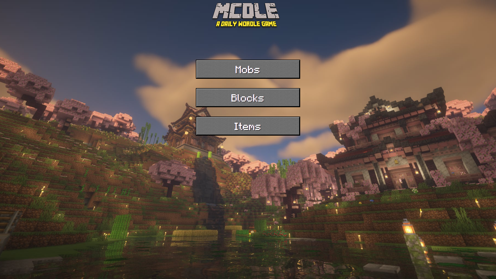

## ⛏️ MCDle – Minecraft Word Game

MCDle is a browser-based puzzle game inspired by Wordle and set in the Minecraft universe.
The player guesses game-related words divided into different categories, while the logic of comparisons and daily challenges are handled on the server side.

### 🎮 Game categories

Each category has its own challenge of the day:
- 🐮 **Moby**
- 🧱 **Blocks**
- 🧰 **Items**
- 🛠️ **Crafting**

Players can solve challenges independently for each category.

##  ✨ Features

- **Wordle-style word guessing**
- **Separate daily challenge for each category**
- **Backend answer comparison**
- **Unlimited number of attempts**
- **Scoreboard:**
    - Number of attempts
    - Completion status
- **Database of words divided into categories**
- **Version system / patch notes**
- **Simple, stylized layout inspired by Minecraft**

## 🏗 Application architecture

The MCDle application was implemented as a hybrid MVC application, combining classic Laravel routing with asynchronous client-server communication.

### Presentation layer (Frontend)

- **Rendered on the server side using Blade views**
- **Classic navigation between subpages implemented by Laravel routing**
- **Gameplay interactions handled asynchronously (AJAX)**
- **Frontend sends queries to the backend and processes responses in JSON format**
- **No game logic or correct responses on the client side**
- **Answers stored in local storage**

### Application layer (Backend)

- **Application based on the Laravel framework (MVC architecture)**
- **Controllers responsible for handling game logic and communication with the database**
- **Separate endpoints returning JSON, used to handle game mechanics**
- **Generating daily passwords independently for each category (mobs, blocks, items, crafting)**
- **Input data validation**
- **All comparison logic performed on the server side**

### Communication
- **Frontend ↔ backend communicate using internal API endpoints**
- **Data is sent in JSON format**
- **Asynchronous communication eliminates page reloads during gameplay**

## 🛠 Technologies

- **PHP 8.x**
- **Laravel 9**
- **MySQL**
- **HTML / CSS**
- **JavaScript**
- **REST API (JSON)**

## 🛠 Project Status
This project is curerently still in progress.

### Implemented Features
- [x] Initial project setup
- [x] Daily mob generation system
- [x] Mob selection and comparison logic
- [x] Result evaluation
- [x] Visual comparison table with color-coded parameter feedback:
    - Green - correct value
    - Yellow - partial match
    - Red - incorrect value
    - Arrows - the value is greater or less
- [x] End-game summary screen with simplified results table
- [x] Option to start a new game after completion
- [x] Base layout and UI structure
      
### In Progress
- [ ] UI/UX improvements and layout refinements
- [ ] Instruction screen
- [ ] Expanded end-game screen
- [ ] Administrator panel (adding, editing, and managing mob pool)
- [ ] Content management system for daily mob database
- [ ] More game mods (Blocks and Items guessing)

## 📸 Screenshots

 **Game Select Page**

**Mob Guessing**

